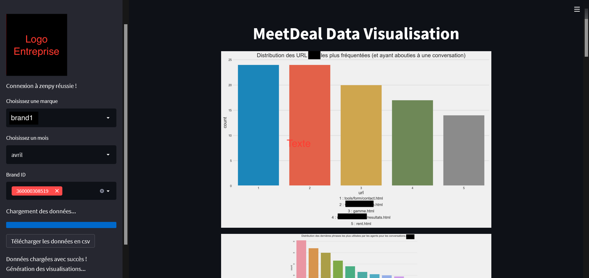

<h1 align="center">
  Streamlit Zenpy's tickets Dataviz 
</h1>

This application was realized with the python library streamlit. It allows to analyse with the help of different visualizations what happened during the conversations between the visitors and the agents. It is also possible to download the data in CSV format for further analysis.

The user must fill in the various fields in the band on the left. Once these have been checked, the data will be loaded. A loading bar indicates the progress.

Among the fields to be filled in, here are the possibilities:

Brands:
- All the brands we work with

Months:
- All the months on the calendar

Brands ids:
- Select the ones you want from those offered

Once the visualisations are displayed, they can be enlarged by clicking on the button at the top right and then saved by 
right-clicking.

To launch the application, simply clone the project, open a terminal in the project environment, go to the source folder and run the command: "streamlit run app.py"

Requirements:

- streamlit
- logging
- datetime
- pandas
- seaborn
- matplotlib
- textwrap
- zenpy
- yaml
